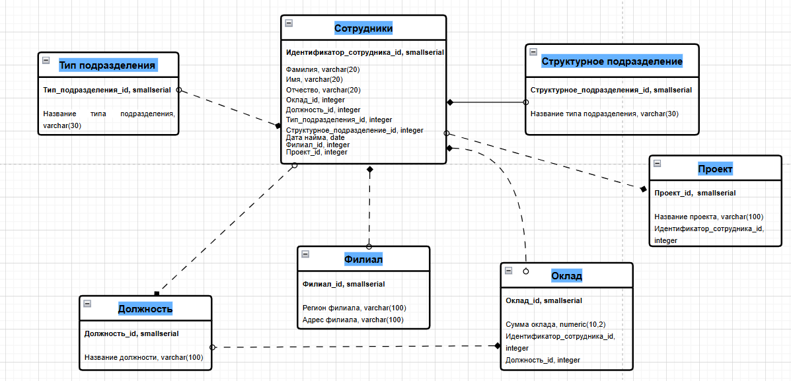

# Домашнее задание к занятию "Базы данных" - Tarkov Viktor


### Инструкция по выполнению домашнего задания

   1. Сделайте `fork` данного репозитория к себе в Github и переименуйте его по названию или номеру занятия, например, https://github.com/имя-вашего-репозитория/git-hw или  https://github.com/имя-вашего-репозитория/7-1-ansible-hw).
   2. Выполните клонирование данного репозитория к себе на ПК с помощью команды `git clone`.
   3. Выполните домашнее задание и заполните у себя локально этот файл README.md:
      - впишите вверху название занятия и вашу фамилию и имя
      - в каждом задании добавьте решение в требуемом виде (текст/код/скриншоты/ссылка)
      - для корректного добавления скриншотов воспользуйтесь [инструкцией "Как вставить скриншот в шаблон с решением](https://github.com/netology-code/sys-pattern-homework/blob/main/screen-instruction.md)
      - при оформлении используйте возможности языка разметки md (коротко об этом можно посмотреть в [инструкции  по MarkDown](https://github.com/netology-code/sys-pattern-homework/blob/main/md-instruction.md))
   4. После завершения работы над домашним заданием сделайте коммит (`git commit -m "comment"`) и отправьте его на Github (`git push origin`);
   5. Для проверки домашнего задания преподавателем в личном кабинете прикрепите и отправьте ссылку на решение в виде md-файла в вашем Github.
   6. Любые вопросы по выполнению заданий спрашивайте в чате учебной группы и/или в разделе “Вопросы по заданию” в личном кабинете.
   
Желаем успехов в выполнении домашнего задания!
   
### Дополнительные материалы, которые могут быть полезны для выполнения задания

1. [Руководство по оформлению Markdown файлов](https://gist.github.com/Jekins/2bf2d0638163f1294637#Code)

---

### Задание 1

Легенда

Заказчик передал вам файл в формате Excel, в котором сформирован отчёт.

На основе этого отчёта нужно выполнить следующие задания.

    Опишите не менее семи таблиц, из которых состоит база данных:

      - какие данные хранятся в этих таблицах;
      - какой тип данных у столбцов в этих таблицах, если данные хранятся в PostgreSQL.

    Приведите решение к следующему виду:

    Сотрудники (

      - идентификатор, первичный ключ, serial,
      - фамилия varchar(50),
      - ...
      - идентификатор структурного подразделения, внешний ключ, integer).


```python
1. Сотрудники (
Идентификатор_сотрудника_id, первичный ключ, smallserial
Фамилия, varchar(20)
Имя, varchar(20) 
Отчество, varchar(20)
Оклад_id, integer, внешний ключ
Должность_id, integer, внешний ключ
Тип_подразделения_id, integer, внешний ключ
Структурное_подразделение_id, integer, внешний ключ
Дата найма, date
Филиал_id, integer, внешний ключ
Проект_id, integer, внешний ключ)

2. Тип подразделения (
Тип_подразделения_id, первичный ключ, smallserial
Название типа подразделения, varchar(30))

3. Структурное подразделение (
Структурное_подразделение_id, первичный ключ, smallserial
Название структурного подразделения, varchar(100))

4. Должность (
Должность_id, первичный ключ, smallserial
Название должности, varchar(100))

5. Филиал (
Филиал_id, первичный ключ, smallserial
Регион филиала, varchar(100)
Адрес филиала, varchar(100))

6. Оклад (
Оклад_id, первичный ключ, smallserial
Сумма оклада, numeric(10,2)
Идентификатор_сотрудника_id, integer, внешний ключ
Должность_id, integer, внешний ключ)

7. Проект (
Проект_id,  первичный ключ, smallserial
Название проекта, varchar(100)
Идентификатор_сотрудника_id, integer, внешний ключ)
```



---
